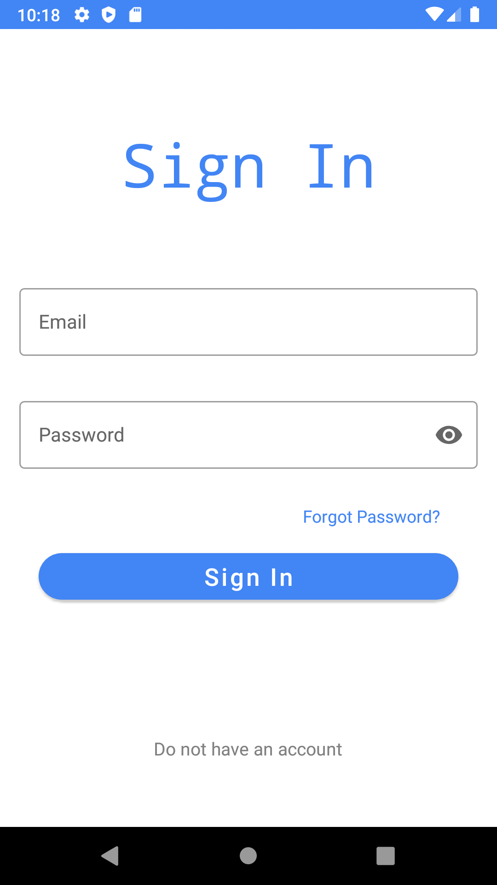
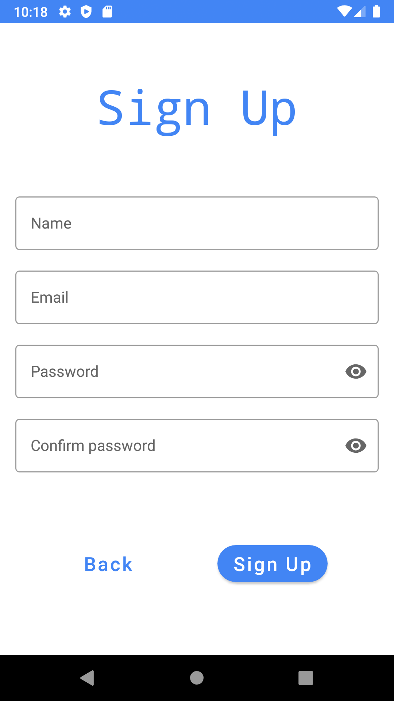
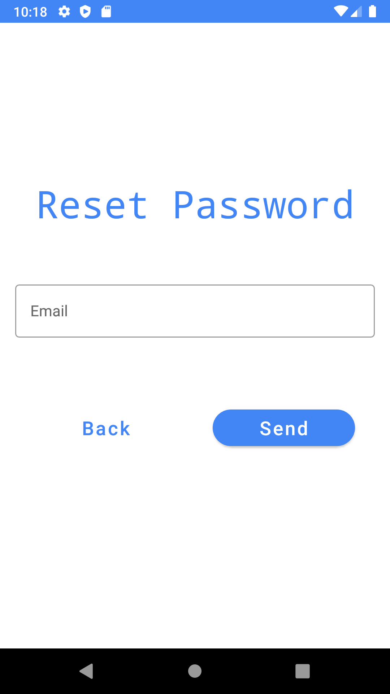
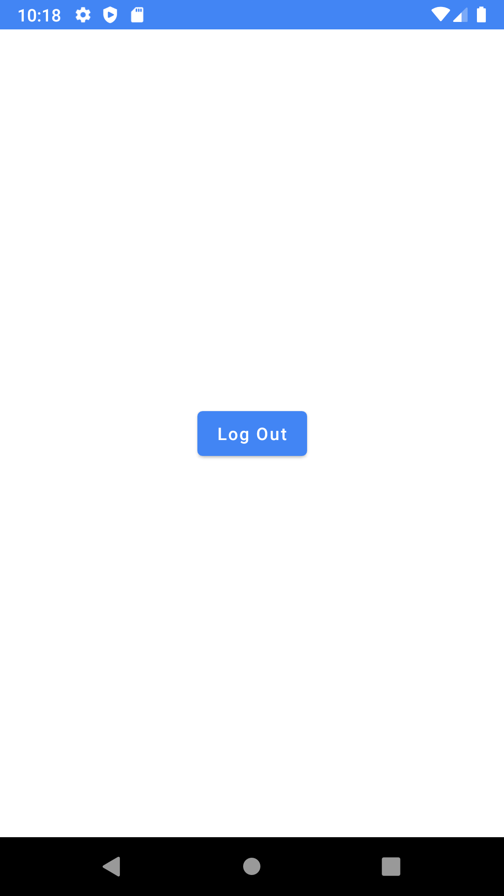

# Sign_in
An simple Registration Application for Android
## Tools used
- Android Studio
- Firebase (For Authentication Services)
- Java (for coding)
## Screens
  1. Signin screen
  
  2. Signup screen
  
  3. Forgot password
  
  4. Main screen (logout)
  
